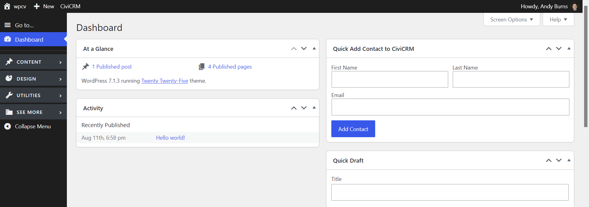

# Admin Sidebar Organizer for WP

**Status: 0.1-alpha.** This is an early release undergoing testing.

Organize the WordPress admin sidebar into configurable, collapsible sections while preserving native menu items and user permissions. Configure once for an installation using a small MU-plugin. Works on multisite.

## Features

- Group menu items into named sections with Dashicons.
- Omit empty sections and keep unassigned items visible under **See More**.
- Keep selected destinations standalone above the sections.
- Start sections collapsed in a new tab; automatically expand the section containing the current page.
- Remember section toggles per site and user within the current browser tab.
- Preserve the full native icon rail when the sidebar is collapsed.
- Keep WordPress's native collapse control at the bottom of the menu; pin the expand control to the viewport bottom in collapsed desktop mode.
- Move WordPress's existing command-palette trigger into a **Go to…** item when available. 
- Optionally keep the Dashboard submenu as a flyout.

## Installation

1. Install this directory as `wp-content/plugins/admin-sidebar-organizer-wp/`.
2. Activate **Admin Sidebar Organizer for WP**. On multisite, network-activate it.
3. Follow the [configuration guide](docs/configuration.md) to install the configuration MU-plugin and define your sections to customize the sidebar organization to your needs.

## Settings

On single sites, open **Settings → Sidebar Organizer**. The Sidebar Options meta box controls **Move command palette to sidebar**, enabled by default.

On multisite, open **Network Admin → Settings → Sidebar Organizer**. 

## Command palette

When relocation is enabled the existing toolbar trigger changes to a **Go to…** entry at the top of the sidebar.

## Developers

See the [developer guide](docs/developers.md) for styling integration and code structure.
